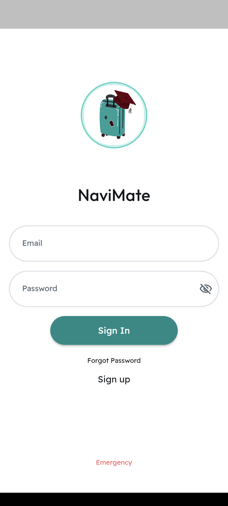
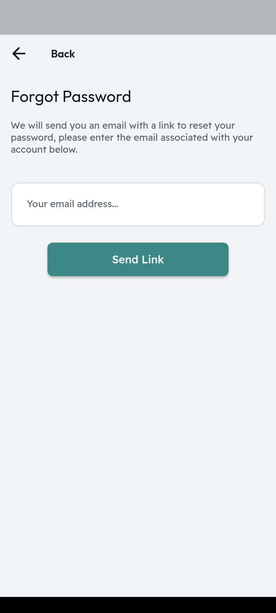
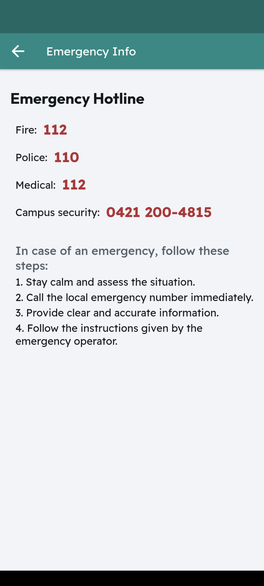

# NaviMate

## Table of contents:
- Introduction
- Problems
- SDGs

## Introduction
Navimate is a dynamic platform designed to empower international students during their transition into new academic environments by offering customized support tailored to their unique needs. Leveraging advanced technologies like Google Maps and machine learning, the app seamlessly connects users with essential services including healthcare, health insurance, local markets, banking, off-campus housing, and public transportation. It also facilitates integration into local communities, enhancing students' cultural acclimation and ensuring a successful commencement of their academic journey.

## Problems
Students often encounter a spectrum of challenges upon entering a novel academic environment, particularly in a foreign country, such as language barriers, unfamiliar banking systems, and accessing specialized healthcare—issues that can impede their academic success and well-being. 

Problem 1: Finding services
	Securing insurance, finding health services without a language barrier, navigating locations, discovering off-campus housing details, and finding an appropriate bank for students. 

Problem 2: Financial Burden
	Living alone brings both excitement and intimidation, with individuals potentially unsure about the nearby places that are cheap and buy affordable housing.

Problem 3: Academic and Career Services
	Challenges related to academics, class expectations, and exams
 
## SDGs

## App Demo

Pages | Description
:--:|:--:
 Sign In Page | The Sign In page enables users to log in with email and password.
Forget Password | If the user does not remember their password, there is a Forget Password page which helps users to restore their password.
Emergency Info Page|If there is an emergency and the user is not able to log in, we are providing an emergency information button which will show the user emergency hotlines.
Sign Up Page|To create an account, we provide a Sign Up page where users need to provide their name, surname, email address, password and select their university (at this moment, there can be selected only one university - Constructor University). 
Sign Up Page (filled in) | This picture should be with 4
Verify Page | After clicking on a “create account” on the Sign Up page, the user will be sent a verification email and after they verified it they can move on to the next page.
Verify Page (pop up notification) | This picture should be with 6
Main Page | Welcome to the Main Page! From here users can access everything in the app. Let’s start by going to the Health Services Page.
Health Services Page|From this page there are few options we can go to: Emergency Page, General Practitioners Page, Hospitals Page and Specialists Page. The Emergency Page is leading to the same page we had on the Sign In Page. As for others, they have almost similar structures. Let’s start from General Practitioners.
General Practitioners Page|We can already see the general practitioners names, addresses, phone numbers (clickable) and their locations - “map” (clickable). There are few features that users can use to optimize their search: map, search bar, filter and sorting.
Map Page|After clicking on the upper-right button on the General Practitioners Page, opens up the Map Page which shows all the general practitioners locations.
General Practitioners Page (filter and sorting showing)|This picture should be with 10
General Practitioners Page (filter - english)|Can be filtered by english speaking doctors
General Practitioners Page (filter - english and tk)|Or by insurance (TK, AOK)This picture should be with 13
General Practitioners Page (sort - likes)|Doctors can be sorted by most liked to list liked
General Practitioners Page (search)|Users can search doctors too.This picture should be with 15
Doctor Page|After finding their preferable doctors, users can learn more on this page which provides multiple great features.
Doctor Page (number)|On the Doctor's Page we can click on the number which will transfer us to make a call or click on “More information” which will open the website of the doctor. 
Doctor Page (website)|This picture should be with 18
Doctor Page (map)|If the user scrolls down a bit, we will be able to see a map where the doctor is located. Also, the red pin is clickable which opens up location in google maps application.
Doctor Page (actual map)|This picture should be with 20
Doctor Page (comment)|Users can also like and leave comments about the doctor.
Doctor Page (like)|This picture should be with 22
Write a Review Page|For the user to write a review, they need to click on write a review on Doctor’s Page and Write a Review page will open up. Users can use anonymous to publish their review anonymously. Write their review in the field and click on the “Publish Review” button.
Write a Review Page (written)|This picture should be with 24
Doctor Page (new review)|This picture should be with 24
Hospital Description Page |There is the same structure for the hospitals and specialist doctors too. Additionally, if it was provided, there is an email which users can use to email the facility. By clicking on the email, the user will be redirected to the mailing platform of their choice.
Hospital Description Page (email)|This picture should be with 27
Specialists Page|General Practitioners and Hospitals have similar starting page, however before users start looking for specialists, there is one more page. On this page, the user can choose which specialist they need and then comes the searching page.
Specialists Search Page|This picture should be with 29
Specialist Description Page part 1|Similar page structure as was for general practitioners and hospitals.
Specialist Description Page part 2|This picture should be with 31
Insurance Page|Users can see what insurances are available for them and read more by clicking on the logo. If the user wants to learn more about them there is a button provided for “Learn More” which opens the website of the insurance company.
TK Page|This picture should be with 33
Main Page (others)|Unfortunately, we were not able to provide more information about banks, housing, education, or local stores. However, we are working on it.
Reminders Page |We provide users with a reminders page which will help them remember about their appointments. To add a reminder, the user needs to click on the lower-right button.
Make Reminder Page|This picture should be with 36
Make Reminder Page (date)|Users need to choose the doctor, date and time.
Make Reminder Page (time)|This picture should be with 38
Make Reminder Page (all)|This picture should be with 38
Profile Page (initial)|We provide a profile page where the user can edit their profile, read about us and terms and conditions or log out.
Edit profile (part one)|Users can change their profile photo, name - surname and add their county and date of birth.
Edit profile (part two)|This picture should be with 42
Profile Page (edited)|This picture should be with 42
About Us|Users can see information about team members and read Terms and Conditions.
Terms and Conditions|This picture should be with 45

